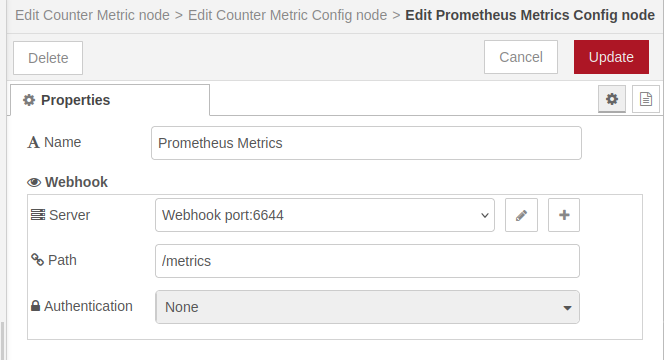

# @theotherwillembotha/node-red-prometheus

Prometheus metrics provider for Node-RED. Built on [@theotherwillembotha/node-red-plugincore](https://github.com/theotherwillembotha/nodered_plugincore) (bundled — no separate install required).

Provides:
- **Prometheus Metrics Config** - a metrics provider config node that exposes a Prometheus-compatible scrape endpoint via the Webhook system
- **Counter, Gauge, Histogram, Summary** metric types - available to any node using the plugincore `@Metrics` decorator

---

## Installation

Either use the **Manage Palette** option in the Node-RED editor, or run the following command in your Node-RED user directory (typically `~/.node-red`):

```bash
npm install @theotherwillembotha/node-red-prometheus
```

---

## Nodes

### Prometheus Metrics Config



A config node that acts as the Prometheus metrics provider for the plugincore `@Metrics` system. Once configured, it appears in the metrics selector dropdown of any node built with the `@Metrics` decorator.

| Field | Description |
|-------|-------------|
| **Name** | Display label for this config node |
| **Webhook Path** | The HTTP path Prometheus will scrape (configured via the Webhook section) |
| **Webhook Port** | The port the scrape endpoint listens on (configured via the Webhook section) |

The scrape endpoint responds to `GET` requests with metrics in the standard Prometheus exposition format, using the content type from `prom-client`.

---

## Metric Types

All metric types are created automatically when a node declares them via the `@Metrics` decorator. The following types are supported:

### Counter

A monotonically increasing value (e.g. total requests processed).

```typescript
@Metrics({ name: "requests_total", type: MetricType.Counter, description: "Total requests" })
private requests!: CounterMetric;

// usage
this.requests.inc();
```

### Gauge

A value that can go up and down (e.g. current queue depth).

```typescript
@Metrics({ name: "queue_depth", type: MetricType.Gauge, description: "Current queue depth" })
private queueDepth!: GaugeMetric;

// usage
this.queueDepth.inc();
this.queueDepth.dec();
this.queueDepth.set(42);
```

### Histogram

Records observations into configurable buckets (e.g. request duration). Supports manual, linear, and exponential bucket configurations.

```typescript
@Metrics({ name: "duration_seconds", type: MetricType.Histogram, description: "Request duration" })
private duration!: HistogramMetric;

// usage
this.duration.observe(0.25);
```

### Summary

Records observations and calculates configurable percentiles (defaults: 0.01, 0.1, 0.9, 0.99).

```typescript
@Metrics({ name: "response_size", type: MetricType.Summary, description: "Response size" })
private responseSize!: SummaryMetric;

// usage
this.responseSize.observe(1024);
```

---

## Prerequisites

- Node.js 18+
- Node-RED 4+
- A [Prometheus](https://prometheus.io/) server configured to scrape the endpoint

---

## Repository

- Source: [github.com/theotherwillembotha/nodered_prometheus](https://github.com/theotherwillembotha/nodered_prometheus)
- Issues: [github.com/theotherwillembotha/nodered_prometheus/issues](https://github.com/theotherwillembotha/nodered_prometheus/issues)

## License

[ISC](LICENSE)
